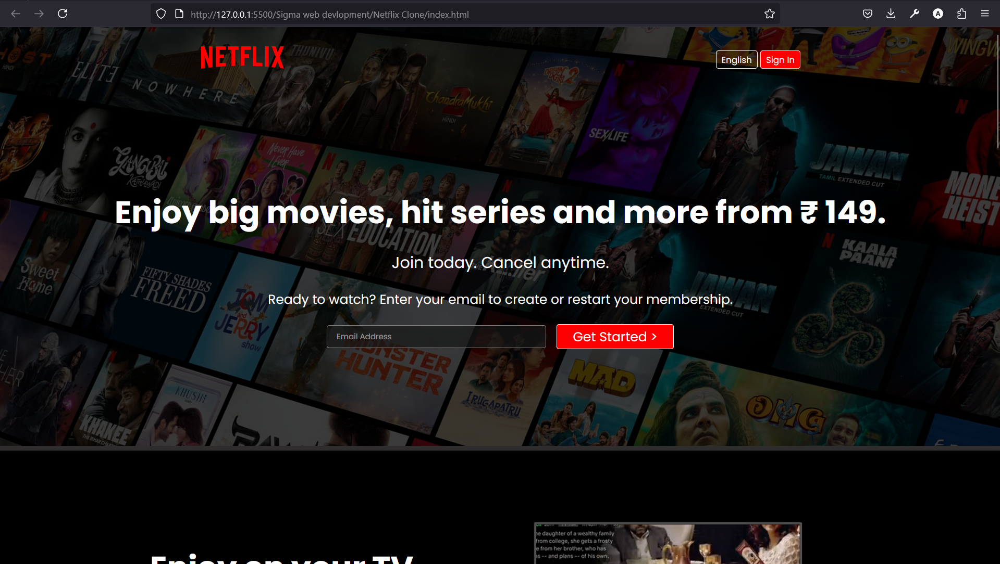
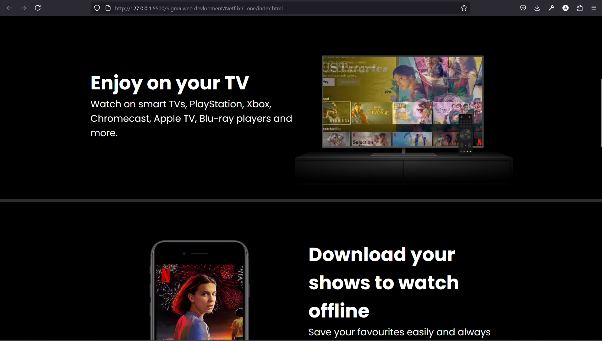

# Netflix Clone

This is my first project, where I’ve created a simple **Netflix clone** using **HTML** and **CSS**. It showcases a static layout similar to Netflix, with movie posters and a responsive design.

## **Project Features**

- **Responsive Layout**: Works across different screen sizes (mobile, tablet, desktop).
- **Basic Movie Grid**: Displays movie posters in a grid format.
- **Hover Effects**: Simple hover effects to highlight movie posters (for future enhancements).
- **No JavaScript**: Purely built with HTML and CSS (No dynamic features yet).

##  **Technologies Used**

- **HTML**: For structuring the webpage content.
- **CSS**: For styling and making the design responsive.

##  **Setup Instructions**

1. Clone the repository:
    ```bash
    git clone https://github.com/anujvishwakarma07/Netflix-Clone.git
    ```

2. Navigate to the project folder:
    ```bash
    cd Netflix-Clone
    ```

3. Open the `index.html` file in your browser to view the project.

## 🖼️ **Screenshots**





## 📌 **Next Steps**

- Implement **JavaScript** to add dynamic features like hover details and interactive movie trailers.
- Explore **backend integration** for fetching movie data dynamically.
- Enhance UI with more features like **search bar**, **user authentication**, and **movie details page**.

## 👨‍💻 **About Me**

This is my first project, and I built it to learn and practice the basics of web development. I'm planning to enhance it by adding interactivity and more features in the future.

- **Anuj Vishwakarma**  
  GitHub: [@anujvishwakarma07](https://github.com/anujvishwakarma07)

## 📄 **License**

This project is open-source and licensed under the MIT License.

